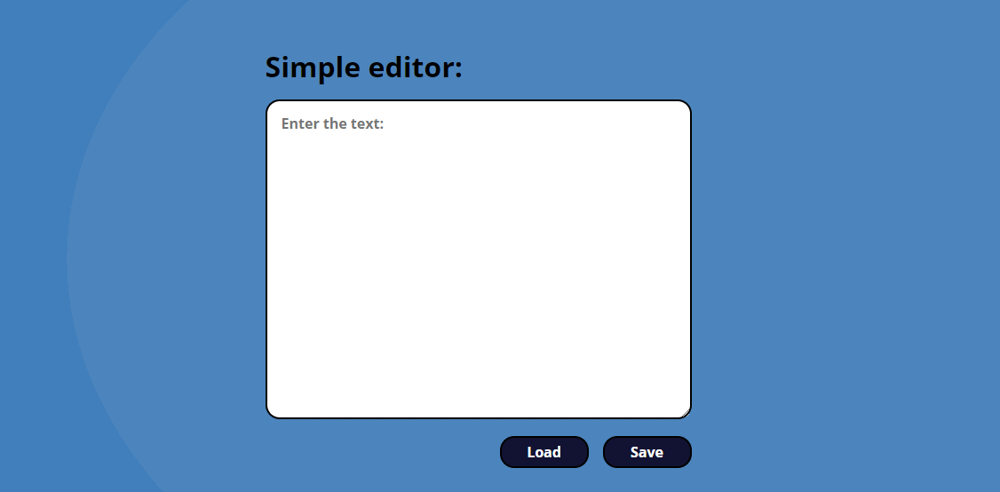

# simple editor

Zapraszam na moją strone: [simple-editor](https://dawiddomaradzki.github.io/hydrapp/)

## Działanie edytora

Edytor wykorzystuje localstorage. Za pomocą save zapisuje wprowadzony tekst, load wczytuje zapisany tekst z localstorage.
